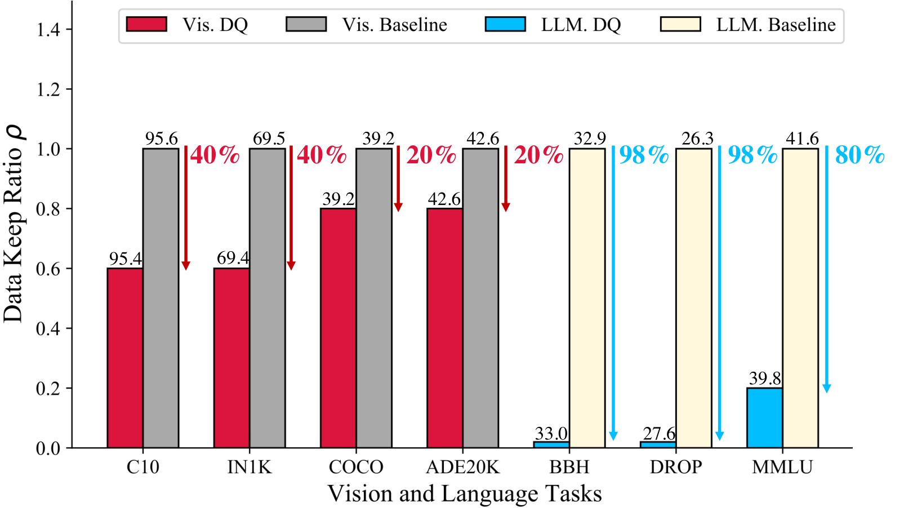
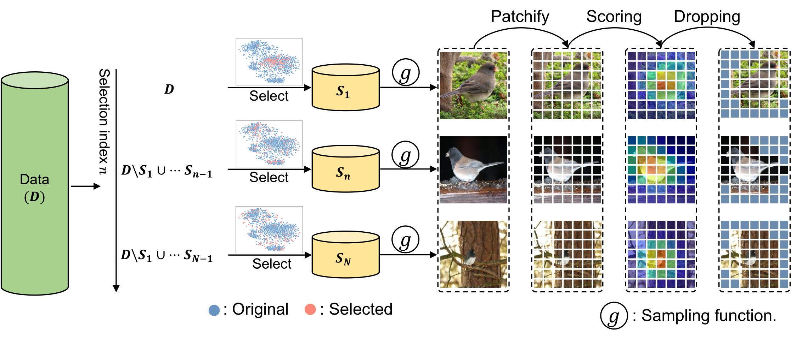

# Dataset Quantization for both Vision and Language Tasks


<p align="center"></p>

## Dataset Statistics


#### CIFAR 10

1. 60K RGB Images 
2. 32x32
3. 10 classes
4. 6K per class
5. 50K Train, 10K Test

#### Imagenet 1K
1. Train 1,281,167
2. Validation 50,000
3. 1000 Classes

## DQ for Image Classification

### Overview



Dataset Quantization is conducted in the following steps:

1. Dataset bin generation. Firstly we iteratively select non-overlapping dataset bins according to the submodular function. 
2. Bin sampling. Then we uniformly sample a certain portion (the required data keep ratio) from each bin and form the final compact set. 
3. Pixel quantization and reconstruction. We employ a GradCAM module to select informative image patches. By only storing the informative patches, the required storage can be further reduced. An MAE model is adopted for image reconstruction. For simplicity, here we directly conduct the reconstruction for evaluating our full method. 

### Data Preparation

- Put [CIFAR-10](https://www.cs.toronto.edu/~kriz/cifar.html) data to `~/data_cifar`.
- Put unzipped [ImageNet](https://www.image-net.org/) data to `~/data_imagenet`.

### Quantization

**CIFAR-10**

```bash
# Dataset bin generation (By default we use a bin number of 10)
CUDA_VISIBLE_DEVICES=0 python -u quantize_sample.py \
    --fraction 0.1 --dataset CIFAR10 --data_path ~/data_cifar \
    --num_exp 10 --workers 10 -se 0 --selection Submodular --model ResNet18 \
    -sp ../results/bin_cifar_010 \
    --batch 128 --submodular GraphCut --submodular_greedy NaiveGreedy --pretrained

# Bin sampling (Change the fraction parameter to obtain different data keep ratio)
CUDA_VISIBLE_DEVICES=0 python -u quantize_bin.py \
    --fraction 0.125 --dataset CIFAR10 --data_path ~/data_cifar \
    --workers 10 --selection_path ../results/bin_cifar_010/ \
    -sp ../results/sample_quantized_cifar_010

# Image reconstruction (Change the mask_ratio parameter to obtain different patch drop ratio)
CUDA_VISIBLE_DEVICES=0 python -u quantize_pixel.py \
    --data CIFAR10 --data_path ~/data_cifar \
    --output_dir ../results/pixel_quantized_cifar --model mae_vit_large_patch16 \
    --resume ./pretrained/mae_visualize_vit_large_ganloss.pth --batch_size 128 \
    --mask_ratio 0.2 --cam_mask
```

We have provided the selected 12.5% indices in the `data/cifar10` folder, which can be directly used for evaluation. 

**ImageNet**

```bash
# Dataset bin generation (By default we use a bin number of 10)
CUDA_VISIBLE_DEVICES=0 python -u quantize_sample.py \
    --fraction 0.1 --dataset ImageNet --data_path ~/data_imagenet \
    --num_exp 10 --workers 10 -se 0 --selection Submodular --model ViT_Base_16 \
    -sp ../results/bin_imagenet_010 \
    --batch 128 --submodular GraphCut --submodular_greedy NaiveGreedy --pretrained

# Bin sampling (Change the fraction parameter to obtain different data keep ratio)
CUDA_VISIBLE_DEVICES=0 python -u quantize_bin.py \
    --fraction 0.125 --dataset ImageNet --data_path ~/data_imagenet \
    --workers 10 --selection_path ../results/bin_imagenet_010/ \
    -sp ../results/sample_quantized_imagenet_010

# Image reconstruction (Change the mask_ratio parameter to obtain different patch drop ratio)
CUDA_VISIBLE_DEVICES=0 python -u quantize_pixel.py \
    --data ImageNet --data_path ~/data_imagenet/train \
    --output_dir ../results/pixel_quantized_imagenet --model mae_vit_large_patch16 \
    --resume ./pretrained/mae_visualize_vit_large_ganloss.pth --batch_size 128 \
    --mask_ratio 0.2 --cam_mask
```

### Training

For data keep ratio higher than 10%, we use a batch size of 128. Otherwise, we use a batch size of 16 for sufficient training. 

Note that the final data keep ratio is the multiplication of the fraction in bin sampling and the patch keep ratio in image reconstruction. 

**CIFAR-10**

```bash
CUDA_VISIBLE_DEVICES=0 python validate_cifar.py \
    --data_dir ../results/pixel_quantized_cifar/ \
    --select_indices ../results/sample_quantized_cifar_010/select_indices_CIFAR10_0.125.npy \
    --batch_size 16
```

**ImageNet**

We use `timm` for evaluating the quantized ImageNet data.
For more instructions you can refer to the [README](./pytorch_image_models/README.md) inside the pytorch_image_models folder or the official [timm repo](https://github.com/huggingface/pytorch-image-models). 

```bash
cd pytorch_image_models
sh distributed_train.sh 8 \
    ../../results/pixel_quantized_imagenet ~/data_imagenet/val \
    --select-indices ../../results/sample_quantized_imagenet_010/select_indices_ImageNet_0.125.npy \
    --output ../../results/training_logs \
    --model resnet50 --sched cosine --epochs 260 --lr 0.6 --reprob 0.6 --remode pixel \
    --batch-size 128 --amp --aug-splits 3 -aa rand-m9-mstd0.5-inc1 --resplit --split-bn --jsd --dist-bn reduce
```

## DQ for Instruction Fine-tuning

Here we provide the code of DQ to compress the instruction fine-tunning datasets [alpaca](https://github.com/tatsu-lab/stanford_alpaca/tree/main), which consists of 52K instructions. To compress the dataset, we first extract the embeddings for each instruction with response by OpenAI Embedding API, and then use DQ to sample a fraction of dataset.

### Embedding Extraction

The extracted embeddings can be downloaded from this [link](https://drive.google.com/file/d/1cd9b_EyFpvtzBo2rLDtsSdzBfEZszMAN/view?usp=sharing). The generation fees are smaller than $1.

Optionally, you can generate the embeddings by yourself with your OPENAI key, the `--index` and `--nums` can be used for parallelization.

```bash
python embed.py --index 0 --nums 10000
python embed.py --index 1 --nums 10000
python embed.py --index 2 --nums 10000
python embed.py --index 3 --nums 10000
python embed.py --index 4 --nums 10000
python embed.py --index 5 --nums 10000
```

Then, you can merge the embeddings with the following command:

```bash
python alpaca_embed.py --merge
```

### DQ Sampling

To generate the sampled dataset, you can run the following command:

```bash
python alpaca_sample.py --ratio 0.1 --k 10
```

For your reference, we provided some sampled results in the `data/alpaca` folder.

### Training

We use [stanford_alpaca](https://github.com/tatsu-lab/stanford_alpaca/tree/main) to finetune the 7B llama model. Please follow the instructions in the repo to run the finetuning. For the 1k sampled dataset, we use the following command to finetune the model. The hyper-parameter comes from the [LIMA](https://arxiv.org/abs/2305.11206) paper.

```bash
torchrun --nproc_per_node=8 --master_port=<your_random_port> train.py \
    --model_name_or_path <your_path_to_hf_converted_llama_ckpt_and_tokenizer> \
    --output_dir ./data/alpaca/alpaca_data_dq_k5_1k.json \
    --data_path <your_output_dir> \
    --bf16 True \
    --num_train_epochs 9 \
    --per_device_train_batch_size 4 \
    --per_device_eval_batch_size 2 \
    --gradient_accumulation_steps 4 \
    --evaluation_strategy "no" \
    --save_strategy "steps" \
    --save_steps 200 \
    --save_total_limit 10 \
    --learning_rate 8e-6 \
    --adam_beta2 0.95 \
    --weight_decay 0.1 \
    --lr_scheduler_type "linear" \
    --logging_steps 1 \
    --fsdp "full_shard auto_wrap" \
    --fsdp_transformer_layer_cls_to_wrap 'LlamaDecoderLayer' \
    --tf32 True
```

### Evaluation

We use [instruct-eval](https://github.com/declare-lab/instruct-eval) repo to evaluate the finetuned model. Please follow the instructions in the repo to run the evaluation.

